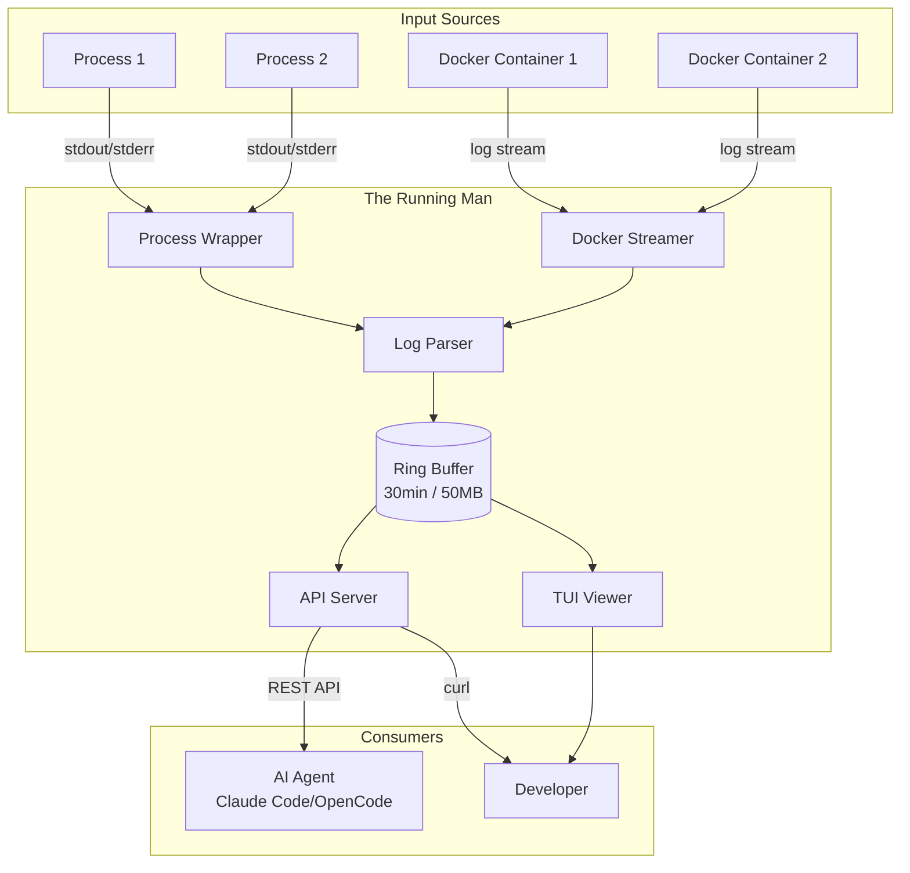

# Architecture

## System Diagram



## Components

### Process Wrapper (`internal/process`)

Spawns and monitors child processes, capturing their output.

- Executes via shell (`/bin/sh -c` or configured shell)
- Captures stdout/stderr without blocking
- Handles graceful shutdown (SIGINT/SIGTERM)
- Optional restart on crash (Phase 2.5)
- Preserves original command for display

### Docker Integration (`internal/docker`)

Streams logs from Docker Compose services.

- Parses docker-compose.yml for service discovery
- Connects to Docker daemon via API
- Streams container logs in real-time
- Handles container restarts automatically
- Demultiplexes Docker's stdout/stderr format

### Log Parser (`internal/parser`)

Detects log formats and extracts structure.

**Formats supported:**
- **Python tracebacks** - Multi-line grouping with stack traces
- **JSON logs** - Field extraction (level, message, trace_id, etc.)
- **Plain text** - Heuristic level detection (ERROR, WARN, INFO)

### Ring Buffer (`internal/storage`)

In-memory circular buffer with time and size limits.

- **Retention:** 30 minutes or 50MB (configurable)
- **Indexed by:** timestamp, source, level
- **Thread-safe:** RWMutex for concurrent access
- **Eviction:** Drops oldest entries when full
- **Survives:** Application crashes (Running Man keeps running)

### API Server (`internal/api`)

REST endpoints for querying captured logs.

**Endpoints:**
- `GET /logs` - Query with filters (time, source, level, content)
- `GET /errors` - Recent errors with stack traces
- `GET /health` - System status, buffer stats
- `GET /processes` - Process status and exit codes

See [api-reference.md](api-reference.md) for full documentation.

### TUI (`cmd/running-man/tui.go`)

Interactive terminal UI built with Bubble Tea.

- Tab switching between log sources
- Auto-refresh every 100ms
- Color-coded log levels
- Real-time updates

**Known issues (fixing in Phase 2.5):**
- Newline rendering broken (progress bars garbled)
- Only shows last 5 minutes (should show full retention)

### Config System (`internal/config`)

YAML configuration with validation and defaults.

- **Auto-discovery:** Searches up directory tree for `running-man.yml`
- **Validation:** Schema validation with helpful error messages
- **CLI override:** Command-line flags take precedence
- **Defaults:** Sensible defaults for all settings

## Data Flow

```
1. Process outputs line
   ↓
2. Wrapper captures (via pipe)
   ↓
3. Parser detects format (Python/JSON/plain)
   ↓
4. Parsed entry → Ring Buffer stores
   ↓
5. API serves queries ← Agent polls
   ↓
6. TUI polls API ← Developer views
```

## Extension Points (Phase 3)

### Skills Framework

```
POST /skills/{skill_name}
  - YAML skill definitions
  - Composable debugging patterns
  - Agent-friendly abstractions
```

### Agent Integration

```
GET /context/errors      - Recent errors + context
GET /context/startup     - Process startup logs  
GET /context/source/{id} - All logs for a source
```

### MCP Server (if needed)

```
Tools:
  - search_logs
  - get_errors
  - get_process_status
  - restart_process
```

## File Structure

```
the_running_man/
├── cmd/running-man/          # CLI entry point + TUI
│   ├── main.go              # Command parsing, orchestration
│   └── tui.go               # Bubble Tea viewer
│
├── internal/
│   ├── api/                 # HTTP server, endpoints
│   ├── config/              # YAML schema, loading, validation
│   ├── docker/              # Compose parsing, log streaming
│   ├── parser/              # Format detection, extraction
│   ├── process/             # Wrapper, manager, shell execution
│   └── storage/             # Ring buffer implementation
│
├── docs/                    # Documentation
└── running-man.yml.example  # Example configuration
```

## Technology Choices

- **Language:** Go (fast, great concurrency, easy distribution)
- **HTTP:** Standard library + chi router
- **Docker:** Official docker/client library
- **TUI:** Bubble Tea framework
- **Config:** gopkg.in/yaml.v3
- **Storage:** In-memory (maps + sync.RWMutex)

---

See [implementation-plan.md](implementation-plan.md) for roadmap and future architecture.
