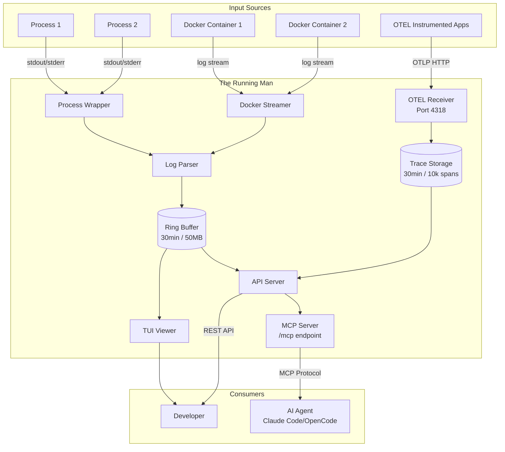

# Architecture

## System Diagram



## Components

### Process Wrapper (`internal/process`)

Spawns and monitors child processes, capturing their output.

- Executes via shell (`/bin/sh -c` or configured shell)
- Captures stdout/stderr without blocking
- Handles graceful shutdown (SIGINT/SIGTERM)
- Optional restart on crash (Phase 2.5)
- Preserves original command for display

### Docker Integration (`internal/docker`)

Streams logs from Docker Compose services.

- Parses docker-compose.yml for service discovery
- Connects to Docker daemon via API
- Streams container logs in real-time
- Handles container restarts automatically
- Demultiplexes Docker's stdout/stderr format

### Log Parser (`internal/parser`)

Detects log formats and extracts structure.

**Formats supported:**
- **Python tracebacks** - Multi-line grouping with stack traces
- **JSON logs** - Field extraction (level, message, trace_id, etc.)
- **Plain text** - Heuristic level detection (ERROR, WARN, INFO)

### Ring Buffer (`internal/storage`)

In-memory circular buffer with time and size limits.

- **Retention:** 30 minutes or 50MB (configurable)
- **Indexed by:** timestamp, source, level
- **Thread-safe:** RWMutex for concurrent access
- **Eviction:** Drops oldest entries when full
- **Survives:** Application crashes (Running Man keeps running)

### API Server (`internal/api`)

REST endpoints for querying captured logs.

**Endpoints:**
- `GET /logs` - Query with filters (time, source, level, content)
- `GET /errors` - Recent errors with stack traces
- `GET /health` - System status, buffer stats
- `GET /processes` - Process status and exit codes

See [api-reference.md](api-reference.md) for full documentation.

### TUI (`cmd/running-man/tui.go`)

Interactive terminal UI built with Bubble Tea.

- Tab switching between log sources
- Auto-refresh every 100ms
- Color-coded log levels
- Real-time updates

**Known issues (fixing in Phase 2.5):**
- Newline rendering broken (progress bars garbled)
- Only shows last 5 minutes (should show full retention)

### OTEL Tracing (`internal/tracing`)

OpenTelemetry tracing support for distributed tracing.

**Components:**

1. **OTEL Receiver (`receiver.go`)**
   - OTLP HTTP receiver on port 4318 (configurable)
   - Supports both JSON and Protobuf formats
   - Handles trace ingestion from instrumented applications
   - Health endpoint for readiness checks

2. **Trace Storage (`storage.go`)**
   - In-memory storage for spans with configurable retention
   - Default: 10,000 spans or 30 minutes
   - Query capabilities by trace ID, service name, span name, status
   - Automatic correlation with logs via `trace_id` field

3. **Span Management (`span.go`)**
   - Span data structure with full OpenTelemetry attributes
   - Parent-child relationship tracking
   - Duration calculation and status mapping
   - Service name extraction from resource attributes

**Integration:**
- Processes can be automatically instrumented with OTEL when tracing is enabled
- Logs and traces are correlated via `trace_id` field
- MCP tools provide trace exploration capabilities

### Config System (`internal/config`)

YAML configuration with validation and defaults.

- **Auto-discovery:** Searches up directory tree for `running-man.yml`
- **Validation:** Schema validation with helpful error messages
- **CLI override:** Command-line flags take precedence
- **Defaults:** Sensible defaults for all settings

## Data Flow

### Log Processing Flow
```
1. Process outputs line
   ↓
2. Wrapper captures (via pipe)
   ↓
3. Parser detects format (Python/JSON/plain)
   ↓
4. Parsed entry → Ring Buffer stores
   ↓
5. API serves queries ← Agent polls via MCP
   ↓
6. TUI polls API ← Developer views
```

### Trace Processing Flow
```
1. Instrumented app sends trace via OTLP
   ↓
2. OTEL Receiver processes and validates
   ↓
3. Spans → Trace Storage stores
   ↓
4. API serves trace queries ← Agent polls via MCP
   ↓
5. Logs and traces correlated via trace_id
```

### MCP Integration Flow
```
1. AI Agent connects to /mcp endpoint
   ↓
2. MCP Server authenticates (localhost only)
   ↓
3. Agent calls tools (search_logs, get_traces, etc.)
   ↓
4. MCP Server queries buffer/trace storage
   ↓
5. Results formatted and returned to agent
```

## Extension Points (Phase 3 - Complete)

### MCP Server Implementation (`internal/api/mcp.go`)

**Endpoint:** `GET /mcp` - Model Context Protocol server for AI agent integration

**Available Tools:**

**Log Tools:**
- `search_logs` - Search logs with filters (source, time, level, content)
- `get_recent_errors` - Get errors with surrounding context
- `get_startup_logs` - View logs from process startup

**Process Management Tools:**
- `get_process_status` - Check status of managed processes
- `get_process_detail` - Detailed process information
- `restart_process` - Restart a managed process (with safety checks)
- `stop_all_processes` - Stop all processes (requires confirmation)

**System Tools:**
- `get_health_status` - System health and buffer statistics

**Trace Tools (when OTEL enabled):**
- `get_traces` - List recent traces with filtering capabilities
- `get_trace` - Get detailed trace information including all spans
- `get_slow_traces` - Find traces exceeding duration thresholds

**Integration:**
- OpenCode: Direct remote MCP connection to `http://localhost:9000/mcp`
- Claude Desktop: Requires HTTP proxy server (`@modelcontextprotocol/server-http`)
- Permissions: `running-man_*` wildcard or individual tool permissions
- Authentication: Local-only access (localhost:9000)

### Agent Integration Patterns

**Common Workflows:**
1. **Error investigation:** `get_recent_errors` → `search_logs` for context
2. **Startup debugging:** `get_startup_logs` for failed process initialization
3. **Process monitoring:** `get_process_status` → `get_process_detail` for specifics
4. **System health:** `get_health_status` for buffer stats and uptime

**Safety Features:**
- Read-only tools by default
- Destructive operations require explicit confirmation
- Error handling for invalid process names
- Local-only access (localhost:9000)

## File Structure

```
the_running_man/
├── cmd/running-man/          # CLI entry point + TUI
│   ├── main.go              # Command parsing, orchestration
│   └── tui.go               # Bubble Tea viewer
│
├── internal/
│   ├── api/                 # HTTP server, endpoints, MCP server
│   ├── config/              # YAML schema, loading, validation
│   ├── docker/              # Compose parsing, log streaming
│   ├── parser/              # Format detection, extraction
│   ├── process/             # Wrapper, manager, shell execution
│   ├── storage/             # Ring buffer implementation
│   └── tracing/             # OTEL receiver, trace storage, span management
│
├── docs/                    # Documentation
└── running-man.yml.example  # Example configuration
```

## Technology Choices

- **Language:** Go (fast, great concurrency, easy distribution)
- **HTTP:** Standard library + chi router
- **Docker:** Official docker/client library
- **TUI:** Bubble Tea framework
- **Config:** gopkg.in/yaml.v3
- **Storage:** In-memory (maps + sync.RWMutex)
- **Tracing:** OpenTelemetry Go SDK (go.opentelemetry.io/proto/otlp)
- **MCP:** Model Context Protocol Go SDK (github.com/modelcontextprotocol/go-sdk/mcp)
- **Protocol Buffers:** google.golang.org/protobuf

---

See [implementation-history.md](implementation-history.md) for roadmap and future architecture.
