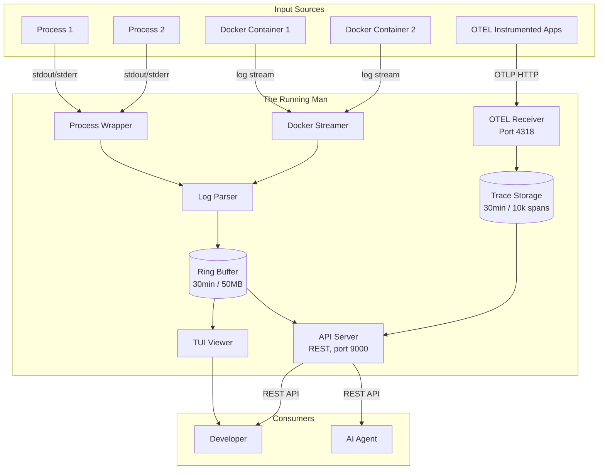

# Architecture

## System Diagram


```mermaid
graph TB
    subgraph "Input Sources"
        P1[Process 1]
        P2[Process 2]
        D1[Docker Container 1]
        D2[Docker Container 2]
        OTEL[OTEL Instrumented Apps]
    end
    
    subgraph "The Running Man"
        PW[Process Wrapper]
        DS[Docker Streamer]
        OTEL_REC[OTEL Receiver<br/>Port 4318]
        PARSER[Log Parser]
        BUFFER[(Ring Buffer<br/>30min / 50MB)]
        TRACE_STORE[(Trace Storage<br/>30min / 10k spans)]
        API[API Server<br/>REST, port 9000]
        TUI[TUI Viewer]
        
        P1 -->|stdout/stderr| PW
        P2 -->|stdout/stderr| PW
        D1 -->|log stream| DS
        D2 -->|log stream| DS
        OTEL -->|OTLP HTTP| OTEL_REC
        
        PW --> PARSER
        DS --> PARSER
        PARSER --> BUFFER
        OTEL_REC --> TRACE_STORE
        BUFFER --> API
        TRACE_STORE --> API
        BUFFER --> TUI
    end
    
    subgraph "Consumers"
        AGENT[AI Agent]
        USER[Developer]
        
        API -->|REST API| AGENT
        API -->|REST API| USER
        TUI --> USER
    end
```

## Components

### Process Wrapper (`internal/process`)

Spawns and monitors child processes, capturing their output.

- Executes via shell (`/bin/sh -c` or configured shell)
- Captures stdout/stderr without blocking
- Handles graceful shutdown (SIGINT/SIGTERM)
- Optional restart on crash (`restart_on_crash`)
- Preserves original command for display

### Docker Integration (`internal/docker`)

Streams logs from Docker Compose services.

- Parses docker-compose.yml for service discovery
- Connects to Docker daemon via API
- Streams container logs in real-time
- Handles container restarts automatically
- Demultiplexes Docker's stdout/stderr format

### Log Parser (`internal/parser`)

Detects log formats and extracts structure.

**Formats supported:**
- **Python tracebacks** - Multi-line grouping with stack traces
- **JSON logs** - Field extraction (level, message, trace_id, etc.)
- **Plain text** - Heuristic level detection (ERROR, WARN, INFO)

**Level detection for plain text**, in order:

1. An explicit level in the text (`ERROR`, `[warn]`, `DEBUG:` …).
2. Unambiguous failure phrases that contain no level word at all — "address already in
   use", "permission denied", "connection refused", "command not found", "no such file or
   directory", "read-only file system", "segmentation fault" and similar. Without these a
   process could die with a perfectly clear message and be classified `info`.
   Deliberately conservative: phrases like "not found" on its own are excluded, because a
   web server logging a 404 is not an error and false positives make `/errors` useless.
3. **stderr raises the floor to `warn`**, not `error`. Many well-behaved tools write
   ordinary progress to stderr (npm, pip, webpack, git), so treating it as an error would
   flood `/errors`. `warn` means "visible if you look, not shouted about".
4. Otherwise `info`.

Separately, the process manager records a `Process "name" failed: exited with code N`
entry whenever a managed process exits non-zero. Process failures used to be printed only
to running-man's own stdout, so nothing about them reached the buffer and `/errors` could
be empty while a process sat there failed.

### Ring Buffer (`internal/storage`)

In-memory circular buffer with time and size limits.

- **Retention:** 30 minutes or 50MB (configurable)
- **Indexed by:** timestamp, source, level
- **Thread-safe:** RWMutex for concurrent access
- **Eviction:** Drops oldest entries when full
- **Survives:** Application crashes (Running Man keeps running)

### API Server (`internal/api`)

REST endpoints for querying captured logs.

**Endpoints:**
- `GET /logs` - Query with filters (time, source, level, content)
- `GET /errors` - Recent errors with stack traces
- `GET /health` - System status, buffer stats
- `GET /processes` - Process status and exit codes

See [api-reference.md](api-reference.md) for full documentation.

### TUI (`cmd/running-man/tui.go`)

Interactive terminal UI built with Bubble Tea.

- Tab switching between log sources
- Auto-refresh every 100ms
- Color-coded log levels
- Real-time updates

**Log window:** the TUI requests `/logs?source=NAME` with no `since`, so it shows the full
retention window rather than a recent slice, capped by the API's default `limit` of 1000
entries.

### OTEL Tracing (`internal/tracing`)

OpenTelemetry tracing support for distributed tracing.

**Components:**

1. **OTEL Receiver (`receiver.go`)**
   - OTLP HTTP receiver on port 4318 (configurable)
   - Supports both JSON and Protobuf formats
   - Handles trace ingestion from instrumented applications
   - Health endpoint for readiness checks

2. **Trace Storage (`storage.go`)**
   - In-memory storage for spans with configurable retention
   - Default: 10,000 spans or 30 minutes
   - Query capabilities by trace ID, service name, span name, status
   - Automatic correlation with logs via `trace_id` field

3. **Span Management (`span.go`)**
   - Span data structure with full OpenTelemetry attributes
   - Parent-child relationship tracking
   - Duration calculation and status mapping
   - Service name extraction from resource attributes

**Integration:**
- Processes can be automatically instrumented with OTEL when tracing is enabled
- Logs and traces are correlated via `trace_id` field
- Trace endpoints provide trace exploration capabilities

### Config System (`internal/config`)

YAML configuration with validation and defaults.

- **Auto-discovery:** Searches up directory tree for `running-man.yml`
- **Validation:** Schema validation with helpful error messages
- **CLI override:** Command-line flags take precedence
- **Defaults:** Sensible defaults for all settings

## Data Flow

### Log Processing Flow
```
1. Process outputs line
   ↓
2. Wrapper captures (via pipe)
   ↓
3. Parser detects format (Python/JSON/plain)
   ↓
4. Parsed entry → Ring Buffer stores
   ↓
5. API serves queries ← Agent queries the REST API
   ↓
6. TUI polls API ← Developer views
```

### Trace Processing Flow
```
1. Instrumented app sends trace via OTLP
   ↓
2. OTEL Receiver processes and validates
   ↓
3. Spans → Trace Storage stores
   ↓
4. API serves trace queries ← Agent queries the REST API
   ↓
5. Logs and traces correlated via trace_id
```

### Agent Integration Flow
```
1. Agent reads the instance marker or probes GET /health
   ↓
2. Agent discovers the surface via GET / or /docs (OpenAPI)
   ↓
3. Agent queries /logs, /errors, /processes, /traces
   ↓
4. API reads the ring buffer / trace storage
   ↓
5. Results returned as JSON
```

## Extension points

### Agent-Facing API (`internal/api/server.go`)

The REST API is the agent-facing interface. It is self-describing: `GET /` lists every
endpoint and `/docs` serves interactive OpenAPI documentation.

**Logs:** `/logs` (filters: `since`, `level`, `source`, `contains`, `exclude`, `limit`),
`/errors`

**Processes:** `/processes`, `/processes/{name}`, `/processes/{name}/restart`,
`/processes/stop-all`

**Traces (when OTEL enabled):** `/traces` (filters: `service`, `span_name`, `status`,
`trace_id`), `/traces/{id}`, `/traces/{id}/logs`

**System:** `/health`

**Access control:** no authentication. Bound to all interfaces by default, with process
control restricted to loopback — see
[network exposure](api-reference.md#network-exposure).

### Agent Integration Patterns

**Common Workflows:**
1. **Error investigation:** `GET /errors?since=10m` → `GET /logs?source=NAME&since=5m` for context
2. **Startup debugging:** `get_startup_logs` for failed process initialization
3. **Process monitoring:** `get_process_status` → `get_process_detail` for specifics
4. **System health:** `get_health_status` for buffer stats and uptime

**Safety Features:**
- Read-only tools by default
- Destructive operations require explicit confirmation
- Error handling for invalid process names
- Local-only access (localhost:9000)

## File Structure

```
the_running_man/
├── cmd/running-man/          # CLI entry point + TUI
│   ├── main.go              # Command parsing, orchestration
│   └── tui.go               # Bubble Tea viewer
│
├── internal/
│   ├── api/                 # HTTP server, REST endpoints
│   ├── config/              # YAML schema, loading, validation
│   ├── docker/              # Compose parsing, log streaming
│   ├── parser/              # Format detection, extraction
│   ├── process/             # Wrapper, manager, shell execution
│   ├── storage/             # Ring buffer implementation
│   └── tracing/             # OTEL receiver, trace storage, span management
│
├── docs/                    # Documentation
└── running-man.yml.example  # Example configuration
```

## Technology Choices

- **Language:** Go (fast, great concurrency, easy distribution)
- **HTTP:** Standard library + chi router
- **Docker:** Official docker/client library
- **TUI:** Bubble Tea framework
- **Config:** gopkg.in/yaml.v3
- **Storage:** In-memory (maps + sync.RWMutex)
- **Tracing:** OpenTelemetry Go SDK (go.opentelemetry.io/proto/otlp)
- **Protocol Buffers:** google.golang.org/protobuf

---

See [implementation-history.md](implementation-history.md) for roadmap and future architecture.
